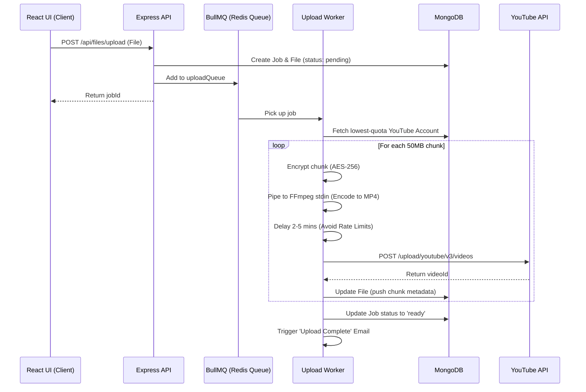
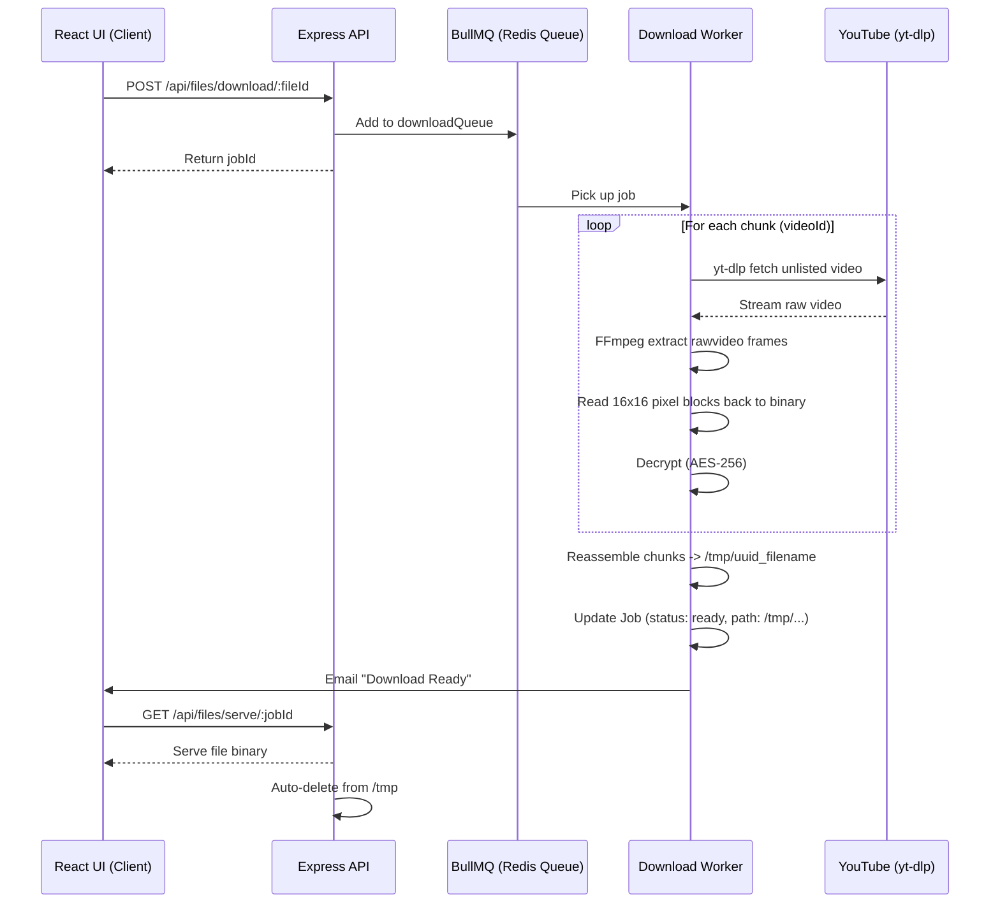

<!-- StrataVideo Drive -->

# 📹 YTVault — Infinite Cloud Storage using YouTube

**YTVault** is a MERN-stack application that provides infinite, free cloud storage by treating YouTube as a backend file system. Users connect their YouTube accounts via OAuth2, and files are encrypted, chunked, encoded into black-and-white block videos using FFmpeg, and uploaded as unlisted videos. Only lightweight metadata is stored in MongoDB.

---

## 🏗 System Architecture & Flow

To understand the core of YTVault, you need to understand the **Encoding/Decoding Pipeline** and how background workers handle heavy lifting asynchronously.

### ⬆️ The Upload & Encode Pipeline

When a user uploads a file, it does not go directly to YouTube. It hits a temporary storage location, gets queued in Redis, and a background worker handles the complex encoding.

### ⬇️ The Download & Decode Pipeline

When a user requests a download, the worker uses `yt-dlp` to fetch the raw video stream, pipes it directly into FFmpeg to extract the pixels, decrypts them, and reassembles the binary.

---

## 📁 Project Structure (The 3 Main Folders)

The project is strictly separated into three main architectural domains:

### 1. `/client` (The Frontend)
Built with React, Vite, and Tailwind CSS v3.
- **`src/pages`**: Contains the core views (`Dashboard`, `Settings`, `Login`).
- **`src/context/AuthContext.jsx`**: Manages the Firebase Google Sign-In state and automatically injects the Firebase ID Token into all outbound Axios requests.
- **`src/components`**: UI elements like the `FileCard` and the `JobStatusPoller` which actively queries the backend to show real-time progress bars for uploads/downloads.

### 2. `/server/controllers` & `/server/routes` (The API Layer)
The standard Express endpoints that the frontend talks to.
- **`authController.js`**: Verifies Firebase tokens and syncs Users/Groups in MongoDB.
- **`fileController.js`**: Handles Multer file uploads, dispatches jobs to BullMQ, and serves finished files.
- **`youtubeController.js`**: Handles the Google OAuth2 flow, exchanging auth codes for access/refresh tokens.

### 3. `/server/jobs` & `/server/utils` (The Engine Room)
This is where the heavy lifting occurs asynchronously, entirely decoupled from the API layer.
- **`encoder.js` & `decoder.js`**: The brains of the operation. Uses `child_process.spawn` to directly stream binary data into FFmpeg as raw pixels, bypassing disk I/O bottlenecks.
- **`encryption.js`**: Secures all data using AES-256-CBC before it touches FFmpeg.
- **`uploadWorker.js` & `downloadWorker.js`**: The BullMQ consumers. They process the queues, manage YouTube API interactions, handle retries, and dispatch emails via Resend.

---

## 🛡️ Security & Authentication (Recent Updates)

To ensure enterprise-grade stability and security, we have recently solidified two critical systems:

1. **AES-256 Dynamic Encryption:**
   - **Previously:** The AES key was derived purely from the user's email address.
   - **Update:** The `deriveKey` function in `encryption.js` now uses a secret salt (`ENCRYPTION_SECRET`) securely loaded from your `.env` file. This means even if someone knows your email and intercepts the YouTube video, they cannot derive the key without the server's master secret.
2. **Robust OAuth2 Client State:**
   - **Previously:** Background workers (and delete functions) instantiated a blank `OAuth2` client using just the `access_token`. This failed (`401 UNAUTHENTICATED`) when tokens became slightly stale.
   - **Update:** All workers now utilize `getOAuth2Client()` which injects your `GOOGLE_CLIENT_ID` and `GOOGLE_CLIENT_SECRET`. We also strictly pass the `refresh_token` to `setCredentials()`. This allows the Google SDK to automatically and silently refresh tokens under the hood, completely eliminating authentication crashes.

---

## 🗺 Development Roadmap & Phase Checklist

| Symbol | Meaning |
|---|---|
| ✅ | Done |
| 🔄 | In Progress |
| ⬜ | Not Started |

### 🟩 Phase 1 — Project Foundation
- ✅ Initialize Node.js + Express backend & Connect MongoDB Atlas
- ✅ Setup `.env` file with keys (Mongo URI, Firebase, YouTube, Redis, Resend)
- ✅ Initialize React frontend with Vite & Tailwind CSS v3
- ✅ Setup basic Express server and connect frontend to backend via Axios

### 🟨 Phase 2 — Group-Based User Authentication
- ✅ Design `Group` and `User` schemas
- ✅ 100% Firebase Authentication (Google Sign-In only) — zero passwords.
- ✅ Custom `verifyFirebaseToken` middleware to protect private routes.
- ✅ Auto-linking of invited members to Vaults.
- ✅ Protected route wrapper in React utilizing AuthContext.

### 🟦 Phase 3 — YouTube OAuth2 Integration
- ✅ Setup Google OAuth2 credentials (`googleapis`).
- ✅ YouTube account connection flow (`auth`, `callback`, `disconnect`).
- ✅ Quota tracking — increment `quotaUsed` by 1600 per upload.
- ✅ Account rotation logic — automatically selects the group member's account with the lowest quota.

### 🟪 Phase 4 — File Encoder / Decoder Pipeline
- ✅ AES-256 encryption (`crypto.createCipheriv`).
- ✅ **Encoder:** Read file in 50MB chunks -> stream raw RGBA pixels to `ffmpeg.stdin` -> Output MP4.
- ✅ **Decoder:** `yt-dlp` download -> FFmpeg extract rawvideo -> decrypt -> reassemble.

### 🟧 Phase 5 — Upload / Download Job Queue
- ✅ Implemented `bull` message queue backed by Upstash Redis.
- ✅ `uploadWorker` handles async encoding and rate-limited uploading.
- ✅ `downloadWorker` handles async downloading, decoding, and writing to `/tmp`.

### 🟫 Phase 6 — File Metadata & Dashboard
- ✅ `GET /api/files` with MIME-type filtering capabilities.
- ✅ `DELETE /api/files/:fileId` properly cleans up unlisted YouTube videos using `getOAuth2Client`.
- ✅ Real-time `JobStatusPoller` on the frontend for progress bars.

### 📧 Phase 7 — Email Notifications
- ✅ Integrated Resend SDK for HTML templates.
- ✅ Dispatches `sendUploadComplete`, `sendUploadFailed`, and `sendDownloadReady` from queues.

### 🚀 Phase 8 — Deployment & Stability
- ✅ Configured `Dockerfile` mapping `ffmpeg`, and `yt-dlp`.
- ✅ Upgraded Firebase Admin SDK to v14 (Modular API).
- ✅ Re-architected OAuth client instantiation across all background workers to prevent `401` token drops.

---

*Last updated: July 2026*
